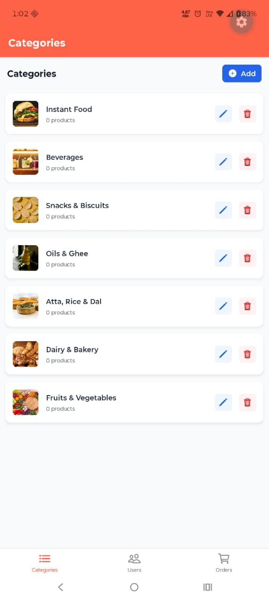
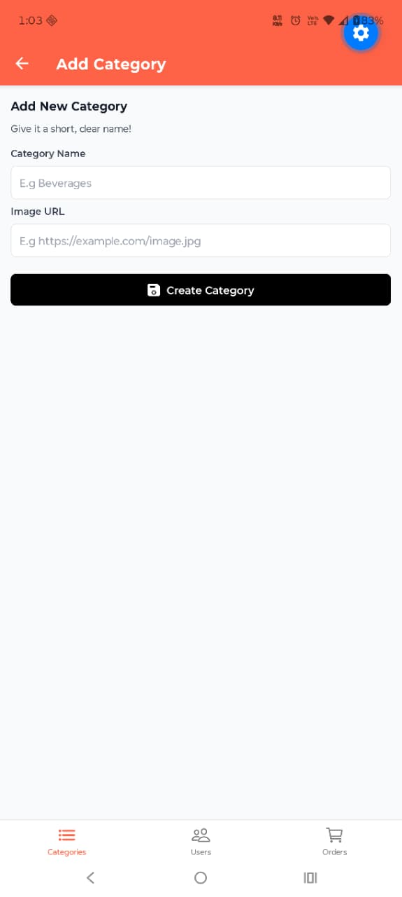
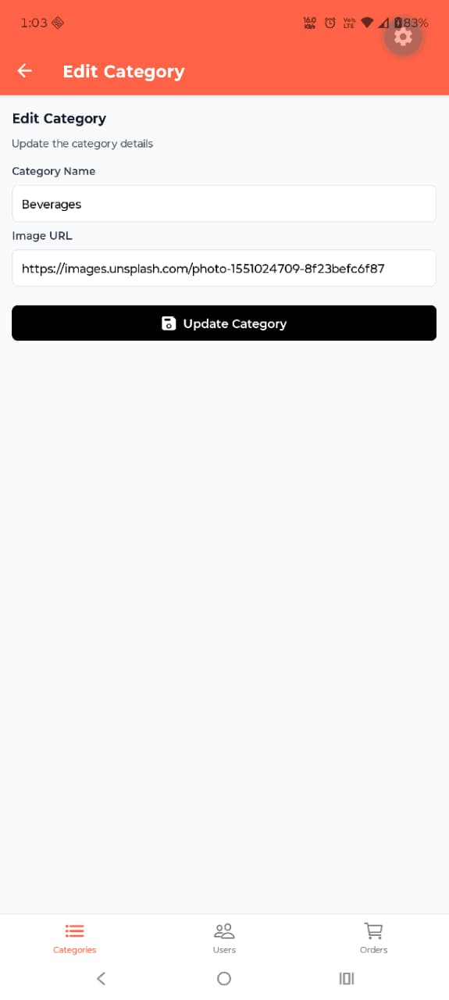
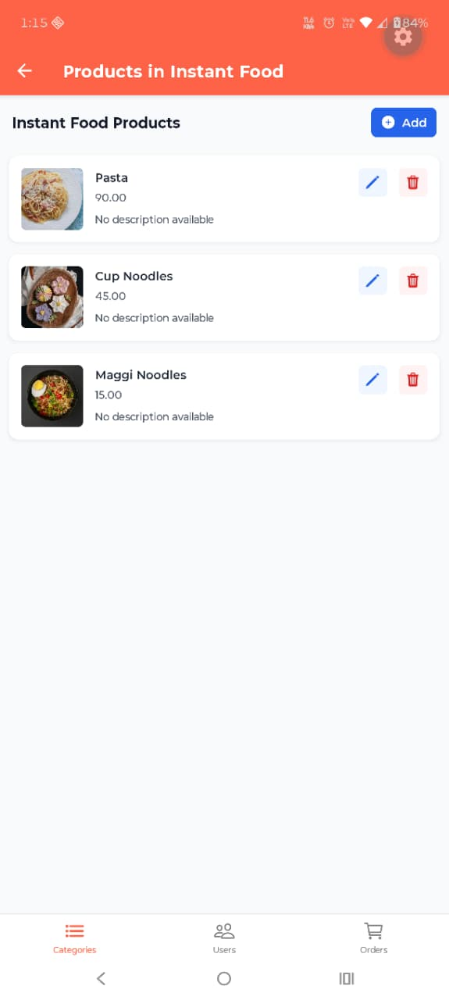
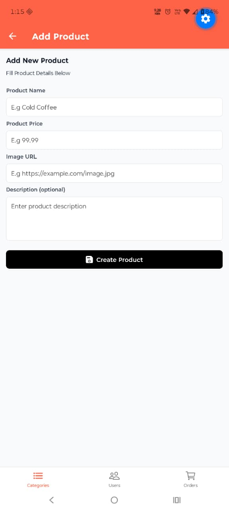
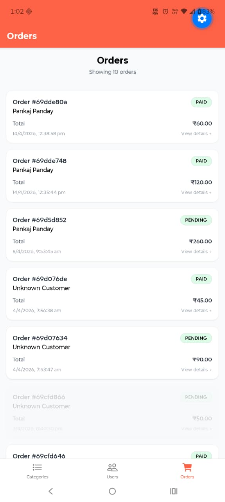
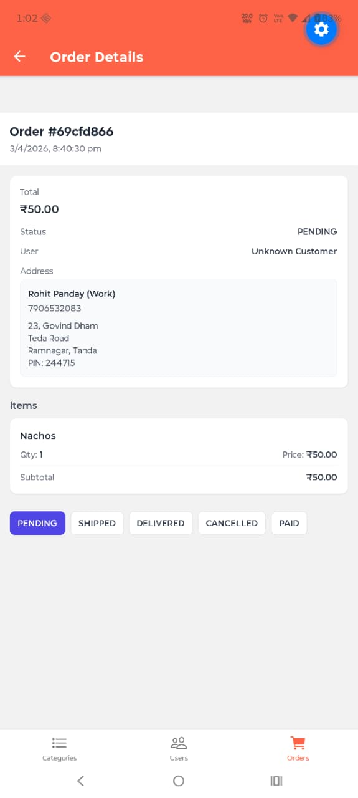

# FreshMeals Admin Panel

A mobile admin panel built with **React Native** to manage the FreshMeals grocery & food ordering application.  
It allows administrators to manage categories, products, users, and orders from a single interface.

The project also includes a **Node.js + Prisma backend API** used for authentication and data management.

---

## Features

- Manage product **categories** (create, edit, delete)
- Manage **products** inside categories
- View and manage **customer orders**
- Update **order status** (Pending, Shipped, Delivered, Cancelled, Paid)
- View registered **users**
- Integrated backend API with **Prisma ORM**
- Clean mobile UI built with **React Native + NativeWind**

---

## Screenshots

### Categories Management

| Categories                       | Add Category                       | Edit Category                       |
| -------------------------------- | ---------------------------------- | ----------------------------------- |
|  |  |  |

Admins can create and manage product categories used in the main grocery application.

---

### Products Management

| Products                       | Add Product                       |
| ------------------------------ | --------------------------------- |
|  |  |

Products can be created inside categories with name, price, image URL and description.

---

### Orders Management

| Orders                       | Order Details                       |
| ---------------------------- | ----------------------------------- |
|  |  |

Admins can view all orders and update their status through the admin panel.

---

### Users

| Users                       |
| --------------------------- |
|  |

Displays all registered users in the application.

---

## Tech Stack

### Mobile Admin Panel

- React Native
- TypeScript
- NativeWind (Tailwind CSS for React Native)
- React Navigation
- Axios

### Backend API

- Node.js
- Express.js
- Prisma ORM
